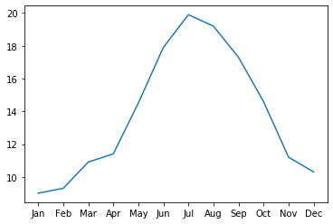
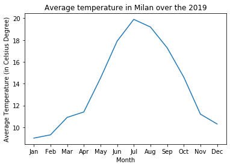
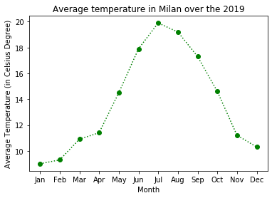
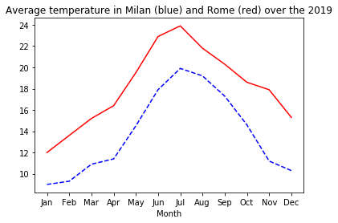
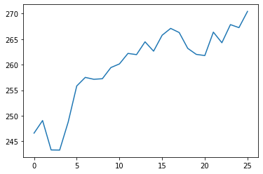
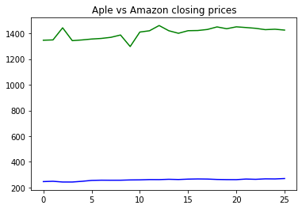

# Data Visualization with Python - Lecture 1
### Instructor: Andrea Giussani (andrea.giussani@unibocconi.it)

## Introduction to MatplotLib

We are gonna work with subplots, which is a matplotlib method,
and basically is made of two objects:
    - figure: it is just a container
    - axes: it's the canvas where you draw your data


```python
import matplotlib.pyplot as plt
%matplotlib inline
```

Let's play a little bit with some data. Adding data to a figure is done by calling methods on the axes object.
We will use two source of data:
     - date: List containing the months of the year
     - avg_temp: List containing the avg_temp in Milan in 2019, measured in celsius


```python

date = ['Jan', 'Feb', 'Mar', 'Apr', 'May', 'Jun', 'Jul', 'Aug', "Sep", 'Oct', 'Nov', 'Dec']
avg_temp = [9.0, 9.3, 10.9, 11.4, 14.5, 17.9, 19.9, 19.2, 17.3, 14.6, 11.2, 10.3]

fig, ax = plt.subplots()
ax.plot(date, avg_temp)
plt.show()

```




Let's customize our plot by adding $\text{x_label}$ and $\text{y_label}$, as well as the title.


```python
fig, ax = plt.subplots()
ax.plot(date, avg_temp)
ax.set_xlabel('Month')
ax.set_ylabel('Average Temperature (in Celsius Degree)')
ax.set_title('Average temperature in Milan over the 2019')
plt.show()
```





### Aesthetics
It looks that the data have been collected continuously.
But the granularity of our data is discrete, since we have measured avg temperature over months
A way to indicate tha we have measured it monthly would be to add markers to the plot that show us where
the data exists and which parts are just lines that connect between the data points.
The plot method take an optional keyword argument, _marker_, which lets you indicate that you are interested in
adding markers to the plot and also what kind of markers you would like.
For example, passing the lowercase letter 'o' indicates that you would like to use circles as markers.
Instead, passing the lowercase letter 'v' indicates that you would like to use down-triangles as markers.

check it out at the following link: https://matplotlib.org/api/markers-api.html


```python
fig, ax = plt.subplots()
ax.plot(date, avg_temp, marker='o', linestyle=':', color='g')
ax.set_xlabel('Month')
ax.set_ylabel('Average Temperature (in Celsius Degree)')
ax.set_title('Average temperature in Milan over the 2019')
plt.show()
```





### Add multiple serieses in the same plot


```python

avg_temp_rome = [12.0, 13.6, 15.2, 16.4, 19.5, 22.9, 23.9, 21.8, 20.3, 18.6, 17.9, 15.3]
fig, ax = plt.subplots()
ax.plot(date, avg_temp, linestyle = '--', color='b')
ax.plot(date, avg_temp_rome, color='r')
ax.set_xlabel('Month')
ax.set_title('Average temperature in Milan (blue) and Rome (red) over the 2019')
plt.show()
```




## Assignment (in class)
We use the data available on blackboard on Apple and Amazon closing pricve stock.
We want to plot the series with matplotlib.


```python
import pandas as pd

apple_stock = pd.read_csv('AAPL_close.txt')
amazon_stock = pd.read_csv('AMZ_close.txt')

fig, ax = plt.subplots()
ax.plot(apple_stock['date'], apple_stock['price'])
plt.show()
```





```python
fig, ax = plt.subplots()
ax.plot(apple_stock['date'], apple_stock['price'], color='b')
ax.plot(amazon_stock['date'], amazon_stock['price'], color='g')
ax.set_title('Apple vs Amazon closing prices')
plt.show()
```



